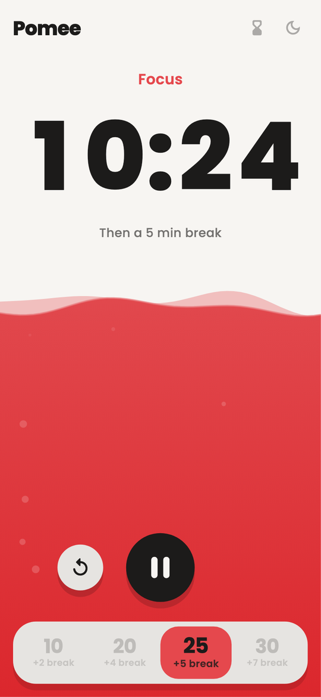
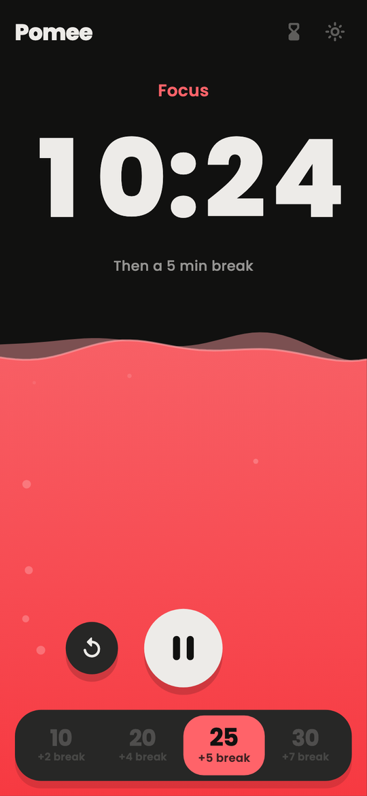
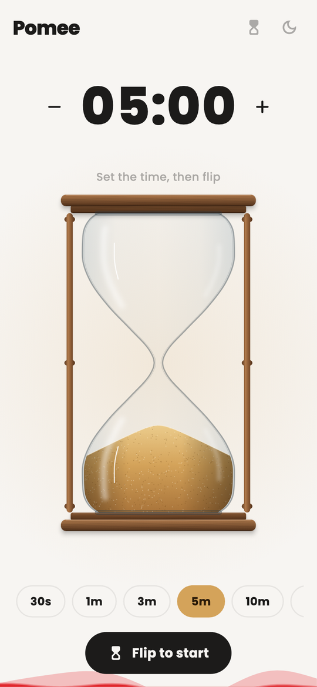
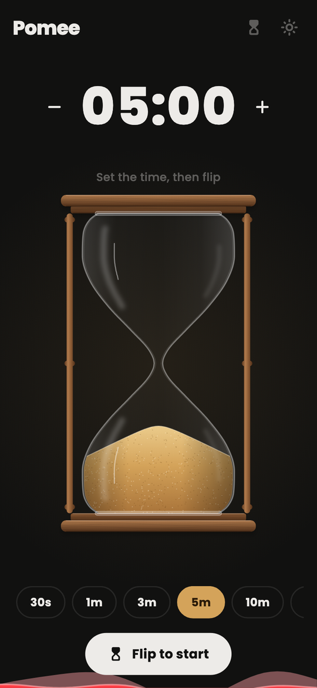

# Pomee

A focus timer whose screen slowly fills with water as you work, with a sand
hourglass you flip like the real thing.

Built with Flutter. Made for Android phones; iOS should work but has not been
tested on a device.

<p>
  
  
  
  
</p>

## Features

- **Pick a session** on the slider at the bottom: 10, 20, 25 or 30 minutes
  of focus, each with its own break. Tap a time or drag the thumb across. It
  is locked while the timer runs; pause to change it.
- **Play** starts or pauses; **reset** appears beside it once a session runs.
- **The water rises** from the bottom as focus time passes and fills the
  screen when it's done. During the break it turns green and drains away.
- **Put the phone down.** Picking it up during a focus session sets off a
  buzzing, flashing "put me down" alarm until you put it back.
- **Hourglass** (top-right icon): the icon turns over and the hourglass takes
  the timer's place on the same screen; tap it again to go back. The focus
  timer keeps counting meanwhile. Choose a time and flip to start. The sand
  always falls toward the ground, flipping the phone sends it back, and
  laying the phone flat pauses it.
- **Light and dark themes** (top-right icon). The choice is remembered.

## Getting started

You need the [Flutter SDK](https://docs.flutter.dev/get-started/install)
(Dart 3.13 or newer) and an Android phone or emulator. The pickup alarm and
the hourglass use the motion sensors, so a real phone is the best way to
try them.

```sh
git clone https://github.com/sayembillah-dev/pomee.git
cd pomee
flutter pub get
flutter run
```

### Development tips

- `flutter run --dart-define=POMEE_FAST=true` turns minutes into seconds, so a
  full focus and break cycle takes under a minute.
- In debug builds, double-tap the background to show the pose sensor readout.

### Checks

```sh
dart format lib test
flutter analyze
flutter test
```

The same checks run on every push and pull request through GitHub Actions.

## Building a release

```sh
flutter build apk --release
```

The APK lands in `build/app/outputs/flutter-apk/app-release.apk` and can be
installed with `adb install -r` or copied to the phone.

Release builds are currently signed with the local debug key, which is fine
for installing on your own devices. To publish on the Play Store, change the
application ID (`com.example.pomee` in `android/app/build.gradle.kts`) and
[set up a signing key](https://docs.flutter.dev/deployment/android#sign-the-app).
Keystores and `key.properties` are ignored by git.

## Code map

| Path | What |
| --- | --- |
| `lib/controllers/pomodoro_controller.dart` | Focus and break state machine |
| `lib/services/pose_estimator.dart` | Phone pose from the sensors; pickup detection |
| `lib/ui/home_screen.dart` | The main screen and the switch to hourglass mode |
| `lib/ui/water.dart` | Rising water: spring-driven level, waves, bubbles |
| `lib/ui/preset_slider.dart` | Tap-or-drag session picker |
| `lib/ui/rolling_text.dart` | Odometer-style rolling digits |
| `lib/models/sand_glass.dart` | Hourglass sand physics (pure, unit tested) |
| `lib/ui/hourglass_painter.dart` | Glass, wood and sand rendering |
| `lib/ui/hourglass_view.dart` | Hourglass mode: time picker, glass and flip controls |
| `lib/ui/spring.dart` | Spring curves and press physics used across the UI |

## Credits

Text is set in [Poppins](https://fonts.google.com/specimen/Poppins) by the
Indian Type Foundry, used under the SIL Open Font License
(`assets/fonts/OFL-Poppins.txt`).

## License

[MIT](LICENSE)
